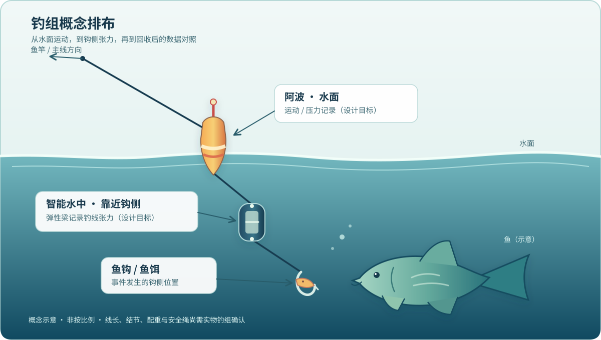
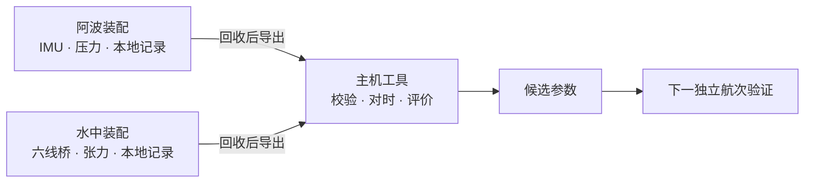
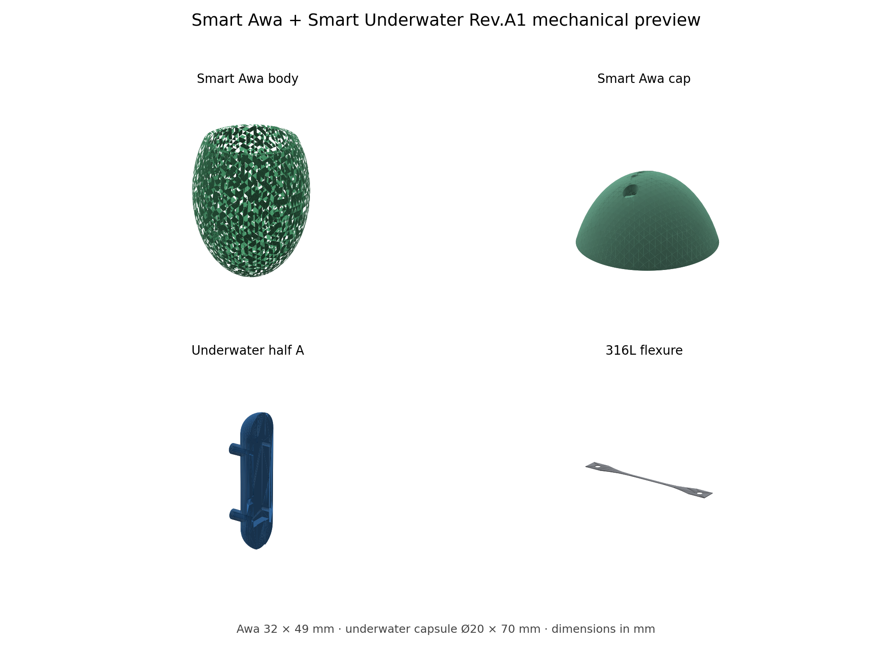

# Smart Apo · 智能阿波与智能水中

一块共用电路板、两种装配方式：阿波记录水面运动与压力，水中端记录钩侧张力。项目尝试用两端原始数据和离线对时，区分水浪扰动与钩侧机械事件。

> [!NOTE]
> **当前项目进度：暂停。原因：完整方案成本过高，超出预算。** 这是项目投入决策；以下工程文件作为研究记录保留，当前不继续首件制造与实物验证。

> [!IMPORTANT]
> **研究原型，尚未做成可投产或可下水的产品。** Rev.A2 的官方 KiCad ERC 为 0 错误、0 警告；DRC 为 0 错误、0 未连接，仍有 **3 项连接区 courtyard 警告**。没有放行的 Gerber、钻孔、最终 BOM/CPL，也没有首件装配、15 m 等效压力或真实水域验证。工程状态为 `NOT_FAB_RELEASED`。

## 钓组如何排布



*概念示意，不按比例。水中端计划靠近子线/鱼钩，钓线经弹性梁受力；图里的鱼只表示研究场景，没有画成已经咬钩。线长、结节、配重及安全绳位置仍需实物钓组确认。*

## 想解决什么问题

普通浮漂会随波浪、横流和钓线扰动运动，仅凭一个瞬时加速度阈值很难判断钩侧是否发生了机械事件。本项目设计了两路记录：阿波采集运动和压力，水中端通过应变桥采集张力；回收设备后再对齐时间、校验数据，并用张力作为离线训练的辅助标签。

“钩侧机械事件”仍不等于“鱼咬钩”。若要判断是否真的有鱼，仍需要摄像、提竿或其他独立真值。[现场验证计划](validation/FIELD_TEST_PLAN_CN.md)保留了这一边界。



*上图是设计的数据路径，不表示整机闭环已经在实物上跑通。*

## 设计概况

| 项目 | Rev.A 设计目标 |
|---|---|
| 阿波外形 | 最大直径 32 mm，高 49 mm |
| 共用 PCB | 12 × 35 × 1.0 mm，四层，计划沉金 |
| 两种装配 | 同板分为阿波版与智能水中版，按 DNP 表区分 |
| 电池 | 候选为带保护 401020 LiPo，60–80 mAh；具体电芯与允许充电电流未锁定 |
| 工作与验证水深 | 目标工作 10 m、15 m 等效静水压力验证；均未实测 |
| 水中张力 | 目标 0–2 kgf；另需独立样件验证 ≥5 kgf 生存 |
| 受力件 | 0.30 mm 316L 弹性梁，不能用打印 STL 代替 |

### Rev.A1 机械概念预览



*图中的梁 STL 仅用于观察形状；实际受力件须按 316L 图纸加工。这张预览不代表 Rev.A2 装配干涉或防水测试通过。*

共用核心包括 STM32G031F8P6、LSM6DSO、LPS28DFW、W25Q256 Flash、充电与稳压电路。阿波版装 LED 驱动；水中版装 NAU7802 和六线桥接口。位号、数量和未贴件以 [Rev.A2 工作 BOM](hardware/revA2/BOM_revA2_WORKING.csv)及[装配变体表](hardware/revA2/ASSEMBLY_VARIANTS_revA2.csv)为准；它们**不是最终采购和贴片文件**。

## 目前完成到哪里

| 领域 | 已有成果 | 尚未成立的结论 |
|---|---|---|
| 电路与 PCB | Rev.A2 独立原理图、项目符号/封装库、四层已布线候选板；KiCad 10.0.6 官方 ERC 0/0、DRC 0 错误/0 未连接 | 3 项 J1/J2/J3 连接区 courtyard 未关闭；板厂工艺、真实装配和独立 Gerber 审查未完成 |
| 数据与主机工具 | UART 解码、CSV 输入检查、事件评价、离线寻参代码及合成数据生成器 | 当前 UART 航次头改动没有专门的端到端验证；合成数据成绩不能代表真实水域性能 |
| MCU 固件 | 采样、Flash 日志、总线和时基的源码与模型测试 | 没有最终可烧录 ELF、板上运行、实测功耗或真正 Stop/RTC 闭环 |
| 机械 | Rev.A1 参数模型、STL、316L 梁 DXF 与装配说明 | 没有匹配 Rev.A2 的完整壳体/器件模型、装配干涉和密封强度结论 |
| 实物验证 | 台架、水槽、压力与真实海况试验方案 | 尚无可据此宣称通过的实物数据 |

最新交付缺口见 [Rev.A2 交付门槛](hardware/revA2/DELIVERY_GATES_CURRENT_CN.md)；暂停时的固件 WIP 边界见 [2026-09-24 检查点](PAUSE_CHECKPOINT_20260924_CN.md)。旧检查点中的错误数和未连接数是历史记录，请以同一版本的最新报告为准。

> [!CAUTION]
> **不要直接把仓库中的 PCB 或任何报价用文件交给板厂生产。** `hardware/revA2/smart_apo_common_revA2.kicad_pcb` 是设计候选版；上级 `hardware/` 目录中的早期 `*_NETS_PLACED.kicad_pcb` 是布局参考。放行须另行完成采购、制造、装配和实物验证，且从最终冻结的板重新导出文件。

## 从哪里开始看

```text
hardware/
  revA2/                     当前电气工程：原理图、PCB、项目库、工作 BOM、检查报告
  smart_apo_common_revA1*    Rev.A1 历史设计；旧 PCB 不可投板
firmware/
  mcu/                       STM32 固件源码、模型测试与构建说明
  host/                      数据解码、CSV 校验、事件评价与离线寻参
mechanical/                  Rev.A1 壳体/托架、316L 梁图纸与打印装配说明
tools/                       生成、结构校验、BOM 检查与制造导出门禁
validation/                  现场试验计划与 Rev.A1 验证记录
CONTEXT_HANDOFF.md           设计来龙去脉和历史决策
PAUSE_CHECKPOINT_20260924_CN.md  暂停时的准确工作边界
```

公开仓库保留可继续开发的源码、工程文件和正式检查结果。本机逐轮候选板、回退快照、编译日志及不完整 3D 审查包未纳入 Git；历史文档提到这些目录时，不应假定它们存在于公开克隆中。

## 在本地验证现有代码

在仓库根目录使用 Python 3 运行以下检查。MCU 测试会调用本机 C 编译器构建宿主模型；它们不是目标板实测。

```bash
python3 -m unittest discover -s firmware/host/tests -v
python3 -m unittest discover -s firmware/mcu/tests -v
python3 -m unittest discover -s tools/tests -v
python3 tools/validate_revA2.py
```

2026-09-24 的公开提交前，上述测试分别为 **34、8、17 项通过**，离线结构检查也通过。它们没有覆盖新航次头的完整 C→UART→Python 路径，不能推导出 MCU 可烧录、PCB 可生产或整机可下水。若安装了 KiCad 10，可另运行官方 ERC/DRC 检查门禁：

```bash
KICAD_CLI=/path/to/kicad-cli bash tools/export_fab_revA2.sh --check-only
```

`--check-only` 会刷新工程目录里的 ERC/DRC 报告，但不会生成制造文件。**不要因为它返回 0 就省略 3 项警告、器件来料、装配和实物门槛。**无参数运行会进入制造导出流程，目前不应将该输出视为放行文件。

若本机另有 NumPy、SciPy，可用合成数据了解离线工具的输入输出：

```bash
python3 firmware/host/generate_synthetic_dataset.py
python3 firmware/host/autotune.py \
  firmware/host/example_data/awa.csv \
  firmware/host/example_data/underwater.csv \
  -o /tmp/smart-apo-synthetic-result.json
```

合成数据仅用于管线冒烟检查。数据字段、缺测拒绝、时间戳回绕条件及真实张力标定要求见 [主机工具说明](firmware/host/README_CN.md)和[采集/调参协议](firmware/DATA_AND_AUTOTUNE_PROTOCOL_CN.md)。

## 为什么尚未放行

1. **连接与采购**：J1 电池线、J2 Pogo、J3 桥路线束的装配占用和工艺未定；CT05、电芯、LED、晶振、MLCC 等仍需准确来料资料。KiCad 无电气错误不能替代这些核对。
2. **机械与环境**：缺 Rev.A2 壳体和关键器件的准确 3D 模型，压力口/O 形圈、电池、Pogo 和双面器件尚未完成实物干涉与密封验证。
3. **固件**：先前编译过 ARM 目标文件，但缺最终链接所需的工具链/运行库；UART 航次头仍是 WIP，真实总线、Flash 掉电、时钟、续航与唤醒均未上板验证。
4. **制造与实测**：尚无经过独立查看的正式 Gerber、钻孔和最终 BOM/CPL；316L 梁标定、≥5 kgf 生存、15 m 等效压力、盐水及真实海况试验均待样机。

项目停在**有可审查的数字工程成果、没有经过实物证明的产品**这一阶段，因完整方案超出预算而暂停。若未来确定新的预算与范围，先修复并验证航次头 WIP，同时用所购器件图纸和板厂能力关闭装配门槛；再考虑首件制造和分级水槽试验。完整顺序见 [PCB 放行清单](hardware/revA2/PCB_RELEASE_CHECKLIST_revA2_CN.md)与[现场试验计划](validation/FIELD_TEST_PLAN_CN.md)。

## 复用与交流

欢迎用 Issue 讨论设计缺口，最好附原厂资料、具体 KiCad 位置或可重复的测量结果。仓库目前没有附带开源许可证；公开可见不等于获得复制、修改或商业再分发的许可。
