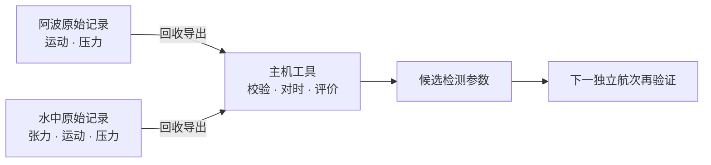

# Smart Apo · 智能阿波与智能水中

**想让浮漂自己记笔记，顺便查清是谁在拽鱼线。** 方案是水面阿波和钩侧水中件各记录一份数据，回收后对时分析。鱼还没参与测试，预算已经先替项目按了暂停键。

> [!NOTE]
> **项目状态：暂停。** 完整方案的预计试制成本超出当前预算。仓库保留研究过程与可审查的工程文件；暂停不等于技术验证通过。

> [!IMPORTANT]
> **制造状态：`NOT_FAB_RELEASED`。** Rev.A2 的 KiCad ERC 为 0 错误、0 警告，DRC 为 0 错误、0 未连接，仍有 **3 项连接区 courtyard 警告**。没有放行的生产 Gerber、钻孔和最终 BOM/CPL，也没有首件装配或水域实测。DRC 很能检查铜线，但不会替你拧紧 O 形圈。

## 先看钓组


*概念示意，不按比例。鱼在饵旁边，没有被画成“已咬钩”的成功案例；线长、结节、配重和安全绳位置仍需实物确认。*

| 设备 | 设计中的任务 | 主要硬件 |
|---|---|---|
| **阿波** · 水面 | 记录加速度、角速度和水压，原始数据写入本地 Flash；预留 LED 提示接口 | STM32G031、LSM6DSO、LPS28DFW、W25Q256、LiPo 供电/充电及 LED 驱动 |
| **智能水中** · 靠近钩侧 | 通过受力梁与应变全桥记录钓线张力，供回收后离线标注；也记录运动和压力 | 共用 MCU、IMU、压力传感器和 Flash，另装 316L 弹性梁、应变片全桥与 NAU7802 |

“共板”是**同一 PCB 设计、两块独立设备、两套贴装清单**。它们计划各自记录，回收后导出；水里不靠实时无线链路传数据。上表描述的是设计功能，尚无装配样机证明这些功能在水里运行。

## 波浪很会演，鱼却不一定配合

浮漂动了，原因可能是浪、流、提竿动作，也可能是钩侧发生了机械事件。这个项目希望用水中张力作研究阶段的辅助标签，寻找阿波的 IMU 与压力信号里可重复的特征，而不是只赌一个瞬时阈值。



这条链路是研究方案，不是已经跑通的产品流程。尤其要说清楚：**张力变化说明钩侧受了力，不自动证明有鱼咬钩。** 摄像、提竿或捕获结果仍需作为语义真值。[现场验证计划](validation/FIELD_TEST_PLAN_CN.md)记录了拟进行的台架、水槽和真实海况测试。

## 尺寸和材料：设计目标，不是合格证

| 项目 | Rev.A 目标或候选 |
|---|---|
| 阿波外形 | 最大直径 32 mm、高 49 mm |
| 共用 PCB | 12 × 35 × 1.0 mm，四层，计划沉金 |
| 首批设想 | 共板 10 片，阿波和水中各装 5 套；**尚未下生产订单** |
| 电池 | 带保护 401020 LiPo，候选 60–80 mAh；所购型号与允许充电电流未锁定 |
| 深度 | 目标工作 10 m、15 m 等效静水压力验证；未实测 |
| 水中张力 | 目标工作 0–2 kgf；另需独立样件验证 ≥5 kgf 生存 |
| 受力件 | 0.30 mm 316L 弹性梁；打印件不能代替它承受钓线拉力 |

<details>
<summary>看看 Rev.A1 的机械概念预览</summary>


这张图展示壳体与梁的工程几何。梁 STL 只供看形状，真实受力件须按 [316L 加工规范](mechanical/316L_FLEXURE_SPEC_CN.md)和 DXF 制作；图像也不表示 Rev.A2 的装配干涉或防水测试通过。

</details>

位号、数量与 DNP 差异请看 [Rev.A2 工作 BOM](hardware/revA2/BOM_revA2_WORKING.csv)和[装配变体表](hardware/revA2/ASSEMBLY_VARIANTS_revA2.csv)。采购后缀与来料尚未全部确认，工作 BOM 不能直接当最终贴片清单。

## 进度条不如证据可靠

| 领域 | 已留下什么 | 还差什么 |
|---|---|---|
| **电路与 PCB** | Rev.A2 原理图、项目符号/封装库、四层已布线候选板；KiCad 10.0.6 官方 ERC 0/0、DRC 0 错误/0 未连接 | J1/J2/J3 的 3 项连接区 courtyard、所购器件与板厂工艺、完整 3D 装配审查和制造文件复核 |
| **主机数据工具** | UART 解码、CSV 输入校验、事件评分、离线寻参和合成数据生成 | 新航次头缺专门的 C→UART→Python 端到端验证；合成数据不能替代真实航次 |
| **MCU 固件** | 采样、Flash 日志、总线与时基源码；宿主模型测试 | 没有最终可烧录 ELF、板上运行、实测功耗或真正 Stop/RTC 闭环 |
| **机械** | Rev.A1 参数模型、STL、316L 梁 DXF 与装配说明 | 缺匹配 Rev.A2 的完整壳体/器件模型、实物干涉和密封验证 |
| **现场研究** | 静载、水槽、压力和真实海况试验计划 | 尚无可用于证明性能或可靠性的样机与实测数据 |

三处警告只是最显眼的剩余提示；更大的缺口在采购、装配和实物。详细情况见 [Rev.A2 交付门槛](hardware/revA2/DELIVERY_GATES_CURRENT_CN.md)与[暂停检查点](PAUSE_CHECKPOINT_20260924_CN.md)。历史检查点中的数字属于当时版本，别把不同日期的报告拼成一块“全绿”的板。

> [!CAUTION]
> `hardware/revA2/smart_apo_common_revA2.kicad_pcb` 是设计候选版；`hardware/` 根目录里早期的 `*_NETS_PLACED.kicad_pcb` 只是布局参考。**仓库里没有可直接付款投产的制造包。**

## 如果你想复现数字检查

在仓库根目录运行。Python 测试使用宿主机 C 编译器验证模型和协议，不能替代板上测试。

```bash
python3 -m unittest discover -s firmware/host/tests -v
python3 -m unittest discover -s firmware/mcu/tests -v
python3 -m unittest discover -s tools/tests -v
python3 tools/validate_revA2.py
```

2026-09-24 公开提交前，三组测试分别有 **34、8、17 项通过**，结构检查也通过；最新 UART 航次头尚缺完整端到端用例。若有 KiCad 10，可用仅检查模式刷新 ERC/DRC 报告：

```bash
KICAD_CLI=/path/to/kicad-cli bash tools/export_fab_revA2.sh --check-only
```

`--check-only` 会更新工程中的检查报告，不生成制造文件。返回 0 只说明脚本规定的电气门禁通过，**不替三处警告、采购、3D 和实物验证签字**。无参数调用会进入制造导出流程，当前项目不应将其结果视作放行。

安装了 NumPy、SciPy 后，还可以用合成数据熟悉离线工具：

```bash
python3 firmware/host/generate_synthetic_dataset.py
python3 firmware/host/autotune.py \
  firmware/host/example_data/awa.csv \
  firmware/host/example_data/underwater.csv \
  -o /tmp/smart-apo-synthetic-result.json
```

这个例子主要验证管线能否处理规定格式，不负责替鱼提供表演。真实数据的字段、缺测规则、时钟回绕与梁标定要求见 [主机说明](firmware/host/README_CN.md)和[数据协议](firmware/DATA_AND_AUTOTUNE_PROTOCOL_CN.md)。

## 仓库地图

```text
hardware/revA2/       当前原理图、PCB、项目库、工作 BOM、正式检查结果
hardware/*revA1*      Rev.A1 历史文件；旧板不能投产
firmware/mcu/         STM32 固件、宿主模型与构建说明
firmware/host/        解码、输入校验、评分和离线寻参
mechanical/           Rev.A1 壳体/托架、316L 梁图纸与装配说明
tools/                生成器、结构检查、BOM 检查、制造导出门禁
validation/           现场试验方案与 Rev.A1 验证记录
CONTEXT_HANDOFF.md    历史决策与交接资料
```

公开仓库保存源码、工程文件和正式检查结果。本机逐轮候选板、回退快照、编译日志及不完整 3D 审查包没有推送到 GitHub；旧文档提及这些目录时，请以仓库实际文件为准。

## 如果哪天预算松口

先补齐 UART 航次头的端到端测试和最终固件链接；再确认电芯、CT05、LED、晶振、MLCC、Pogo 与板厂工艺，关闭连接区警告；随后核对 Rev.A2 壳体/压力口/电池的实物干涉。完成制造文件独立审阅后，才轮到首件、梁标定、压力、盐水和水域试验。[PCB 放行清单](hardware/revA2/PCB_RELEASE_CHECKLIST_revA2_CN.md)给出了更细的关口。

**当前结论仍是：项目因成本超预算而暂停，Rev.A2 未制造放行。** 鱼可以晚点上钩，工程结论不能抢跑。

## 复用与交流

欢迎通过 Issue 指出具体器件、KiCad 位置或可重复的测试问题。仓库中由项目作者原创的代码、设计文件、文档与插图按 [WTFPL Version 2](LICENSE) 发布（SPDX：`WTFPL`）。引用或改作自第三方的器件资料、库内容等仍受其原有权利约束；本仓库的许可证不能替第三方授权。许可证也不等于产品安全或制造放行证明。
